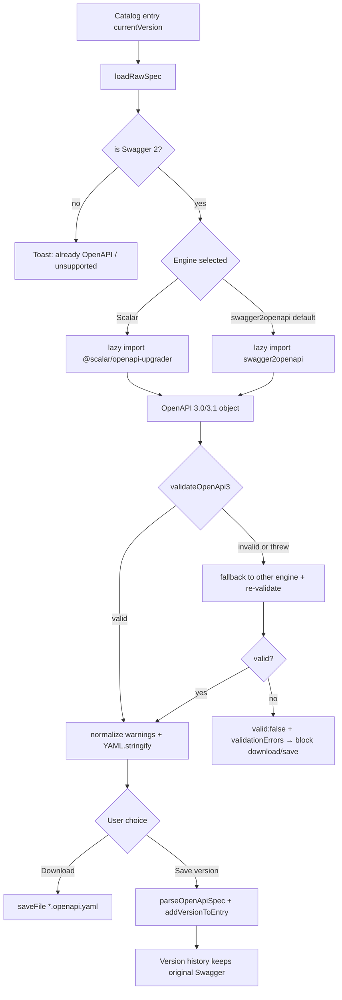

# Catalog — Convert Swagger 2.0 → OpenAPI 3 YAML

> **Status:** Implemented (pending user verify)  
> **Feature area:** API Catalog  
> **Last researched:** 2026-07-18 (web tooling re-surveyed + codebase audit + hands-on engine test)  
> **Goal:** Let users convert an imported Swagger 2.0 catalog spec into a real OpenAPI 3.x YAML file (download and optionally save as a new Catalog version).
>
> **Key change this revision:** ship **both engines, user-selectable**, with a **mandatory validation gate** and **validate-driven auto-fallback**. A hands-on test on a real production Swagger 2.0 spec (§4.5) found **`swagger2openapi` produced valid, correct OpenAPI 3.0** while **`@scalar/openapi-upgrader` produced *silently invalid* output** (broke a `POST` body param and left a Swagger-2 `schemes` field). **Decision:** default to **`swagger2openapi`** (proven correct); keep **`@scalar/openapi-upgrader`** as the selectable alternate (only path to 3.1/3.2); validate every conversion and fall back on **invalid output**, not just thrown errors. See §4.2–§4.5 (comparison + test), §5.3 (selector + validation UX), §6.1 (dual-engine + validation interface).

---

## Phase Status Tracker

| Phase | Title | Status | Notes |
|---|---|---|---|
| P0 | Dual-engine convert util + validation gate + download | ✅ Implemented (pending user verify) | `swaggerToOpenApi.ts` dispatcher + `engines/{swagger2openapi,scalar}Engine.ts` (swagger2openapi@7.0.8 default + @scalar/openapi-upgrader@0.2.11) + owned structural `validateOpenApi3` gate + validate-driven fallback; wired to Sidebar + Overview → download. Both engines confirmed lazy-chunked under Vite (swagger2openapi 207KB / 64KB gz). 60 unit tests; new files ≥90% all metrics |
| P1 | Preview modal + engine/target selector + validation badge | ✅ Implemented (pending user verify) | `CatalogConvertOpenApiModal.tsx` — engine/target segmented selectors (3.1 disabled + auto-corrected for swagger2openapi), live re-convert, ✅/❌ validation badge + error list, summary chips (engine used, fellBack+reason, target, endpoint & warning counts), normalized warnings, YAML preview + `SearchMatchBar` (Cmd+F / Enter / Shift+Enter / Esc). Last `{engine,target}` persisted via `convertPrefs.ts` (dual-mode `readKey`/`writeKey`). Sidebar/Overview action now **opens the modal** via `useCatalogState.catalogConvert` (single raw load + Swagger-2 pre-check) instead of direct download; Download gated on valid + moved into the modal. Mounted in `AppWorkbenchModals`. Tests: modal 26 (96% stmts / 93% br / 100% fn+ln), `convertPrefs` 9 + `useCatalogState` convert 5 (both 100%). tsc clean; 1496 catalog+app tests green. Save-as-version deferred to P2 |
| P2 | Save as new Catalog version | ✅ Implemented (pending user verify) | Modal **Save as new version** (gated on valid, next to Download) → `useCatalogState.handleSaveConvertedVersion` → `parseOpenApiSpec` + `addVersionToEntry` (reuses prune/raw-save/switch). Converted version tagged with a `changelog` line so Version History distinguishes it from the Swagger original; success toast appends a prune note when at `MAX_VERSIONS` (now exported); parse **and** save failures toast + keep the modal open to retry. Wired through `AppWorkbenchModals` + `App.tsx`. Tests: modal +5 (95.7% stmts / 92.9% br / 100% fn+ln), `useCatalogState` save-as-version +7 (100% all metrics). tsc clean |
| P3 | Docs + guide wording fixes | ✅ Implemented (pending user verify) | Corrected `catalog-import-guide.md` (normalize-vs-convert, external-ref accuracy) + `DESIGN.md`/`DATA-MODEL.md`/`PHASES.md` (custom `openApiParser.ts` on `yaml`, internal `#/` refs only, dropped swagger-parser claims, new §13); documented the Convert feature in both catalog guides; CHANGELOG `[Unreleased]` + ROADMAP + project-conventions Key Files updated. **P3 review (2026-07-18):** reconciled all doc surfaces with the shipped P4 feature (Convert **/ Upgrade**, 3.0/3.1/3.2 targets, Scalar-only upgrades, on-demand deep lint, "Nothing to convert" gating, Copy YAML) — updated DESIGN §13 + engine table, both guides (heading + anchor `#convert--upgrade-to-openapi`), CHANGELOG entry, ROADMAP, and project-conventions Key Files (`swaggerToOpenApi` dispatchers + `openApiLint.ts`) |
| P4 | Optional: A/B/C/D/E/F | ✅ Implemented (pending user verify) | **A** 3.0/3.1→3.1/3.2 upgrade (`upgradeOpenApi3Yaml` + `detectSpecFormat`/`availableTargets`, Scalar-only, modal auto-routes Convert vs Upgrade), **B** in-modal **Compare engines** action (runs both engines at 3.0 without fallback and surfaces validity/warnings + identical-vs-different YAML summary), **C** **Batch Convert** action in Catalog sidebar (converts all Swagger 2.0 entries to OpenAPI 3.0 and saves as new versions with changelog tags + summary toast), **D** on-demand `oas-validator` deep lint (`openApiLint.ts`, lazy + graceful, 3.0-only, advisory), **E** Catalog convert demo lesson (`cat-convert-openapi`, 9 steps incl. format-badge spotlight + `openapi: 3.1.1` preview search + Prettify off→on demo + post-save badge) via new `CAT` selectors + `catalogConvertAdapter` + `useDemoCatalogBridge` seed bridge, **F** **Prettify** toggle (canonical, diff-friendly YAML via `openapi-format` `openapiSort`; `prettyYaml.ts` lazy + graceful; `path`/`http`/`https` browser shims added). Added smoke spec scaffold: `e2e/demo-cat-convert-openapi.spec.ts` + script `test:e2e:demo:cat-convert-openapi`. Removed dead dep `@apidevtools/swagger-parser` from `package.json`. Remaining user verification: manual 1× lesson playthrough. |

---

## 1. Executive Summary

Catalog already **imports** Swagger 2.0 and OpenAPI 3.x (JSON/YAML) and normalizes them into the internal `CatalogEntry` model. What it does **not** do today is produce an OpenAPI 3 **document** from a Swagger 2.0 raw file.

**Export Original Spec** downloads the stored raw text unchanged. If the user imported `swagger: "2.0"`, they get Swagger 2 back — even when the filename ends in `.yaml`.

This plan adds an explicit Catalog action:

**Convert to OpenAPI 3 (YAML)** → in-app conversion → download (and optionally save as a new version).

That closes a real product gap for teams who still receive Swagger 2.0 from Spring Boot / Swashbuckle / older generators, but need OpenAPI 3 YAML for tooling, sharing, or re-import.

---

## 2. Problem Statement

### User problem

1. Many enterprise APIs still ship **Swagger 2.0**.
2. Modern tools, CI contracts, and SDK generators expect **OpenAPI 3.x**.
3. Users can already browse Swagger specs in Catalog, but cannot leave with a converted OpenAPI 3 YAML without using an external website/CLI.
4. Product docs currently imply conversion happens on import — which is only true for the **internal Catalog model**, not the stored/exported file.

### Product gap (code vs docs)

| Claim / surface | Reality today |
|---|---|
| `docs/guides/catalog-import-guide.md` — “Swagger 2.0 … converted to OpenAPI 3.0 format internally” | True for `CatalogEntry` fields only |
| `docs/design/api-catalog/DESIGN.md` — `@apidevtools/swagger-parser` handles conversion | **Outdated** — parser is custom `openApiParser.ts`; swagger-parser is an unused dependency |
| Raw storage (`spec:{entryId}-{versionId}`) | Original import text, unchanged |
| `useCatalogState.handleExportSpec` | Downloads raw text as `{name}-v{version}.yaml` |

---

## 3. Current State (Catalog)

### Relevant files

| File | Role |
|---|---|
| `src/features/catalog/utils/openApiParser.ts` | Custom YAML/JSON parser; Swagger 2 + OpenAPI 3 → `CatalogEntry` |
| `src/features/catalog/hooks/useCatalog.ts` | Versions (max 10), `loadRawSpec`, `addVersionToEntry` |
| `src/app/hooks/useCatalogState.ts` | `handleExportSpec` download |
| `src/features/catalog/components/CatalogSidebar.tsx` | Context menu: Export Original Spec |
| `src/features/catalog/components/CatalogOverview.tsx` | Re-import / Export Spec / Version History |
| `src/features/catalog/components/CatalogImportModal.tsx` | File / paste / URL / gallery import |
| `src/shared/utils/idbCatalog.ts` + `storageCatalog.ts` | Entry + raw-spec persistence |
| `package.json` | Has `yaml` (^2.8.3) and unused `@apidevtools/swagger-parser` |

### Import pipeline today

```
File | Paste | URL | Gallery
        ↓
  parseOpenApiSpec(rawText)
        ↓
  CatalogEntry (normalized) + rawSpec (unchanged string)
        ↓
  IDB/Tauri: entries + per-version raw
```

### Format support today

| Format | Import browse | Raw stored as | Export Original Spec |
|---|---|---|---|
| Swagger 2.0 | ✅ Normalized into model | Swagger 2 text | Swagger 2 text |
| OpenAPI 3.0.x / 3.1.x | ✅ | OpenAPI 3 text | OpenAPI 3 text |

### Limitations that affect conversion design

- Internal `$ref` only (`#/...`); no external multi-file resolution in the Catalog parser (`followRef` returns `undefined` for any non-`#/` ref — `openApiParser.ts:53–62`).
- Only HTTP methods: GET, POST, PUT, PATCH, DELETE (`SUPPORTED_METHODS`, `openApiParser.ts:11`).
- No dedicated Catalog `data-testid` namespace yet (no `CAT.*` in `src/shared/selectors.ts`); UI is styled with CSS `cat-*` classes in `src/styles/catalog.css`.
- Max **10** versions per entry (`MAX_VERSIONS`, `useCatalog.ts:10`) — saving converted YAML as a version must respect pruning (pruned versions also delete their raw-spec blob, `useCatalog.ts:75–78`).

### Codebase audit corrections (verified 2026-07-18)

These fix small inaccuracies and confirm assumptions the plan depends on:

| Item | Verified reality | Action for this feature |
|---|---|---|
| `isSwagger2RawSpec` helper | **Does not exist.** Only an inline `const isSwagger2 = spec.swagger?.startsWith('2')` inside `parseOpenApiSpec` (`openApiParser.ts:108`) | We must **add** the exported helper (§6.1) |
| `getSpecFormatLabel` | **Exists** (`openApiParser.ts:467–474`) but parses **YAML only** — a JSON-format Swagger 2 spec whose text isn't valid YAML may render as `Unknown` | Reuse for gating, but gate on a robust JSON-or-YAML parse, not on this label |
| `@apidevtools/swagger-parser` | **In `package.json` (`^10.1.1`) but imported nowhere in `src/`** — dead dependency; it does **not** convert 2→3 anyway | Do not adopt; optional cleanup PR to remove it |
| Export label mismatch | Sidebar says **"Export Original Spec"**, Overview says **"Export Spec"** — both call the same `handleExportSpec` | Mirror this: add Convert action next to each, worded consistently |
| Export filename | `{sanitizedName}-v{versions[0].version}.yaml`, always `.yaml` / `text/yaml` even for JSON/Swagger 2 imports (`useCatalogState.ts:12–19`) | Convert output should use a distinct suffix (§10 Q5) so it doesn't collide with the raw export |
| Docs drift | `catalog-import-guide.md` ("converted to OpenAPI 3.0 internally"), `DESIGN.md` + `DATA-MODEL.md` + `PHASES.md` (claim `swagger-parser` parses/validates/converts) are **outdated** — parser is the custom `openApiParser.ts`, model-level normalize only | P3 fixes all four docs, not just the import guide |

---

## 4. Web Research (re-evaluated 2026-07-18)

### 4.1 What conversion must change

| Swagger 2.0 | OpenAPI 3.0.x |
|---|---|
| `swagger: "2.0"` | `openapi: "3.0.x"` |
| `host` + `basePath` + `schemes` | `servers[]` |
| `definitions` | `components.schemas` |
| `securityDefinitions` | `components.securitySchemes` |
| Global `parameters` / `responses` | `components.parameters` / `components.responses` |
| `in: body` / `formData` | `requestBody` + `content.{mediaType}` |
| `consumes` / `produces` | Per-request/response media types |
| `#/definitions/...` refs | `#/components/schemas/...` refs |

**OpenAPI 3.1** is a separate upgrade (JSON Schema Draft 2020-12, `nullable` → `type: [..., null]`, `exclusiveMinimum` becomes numeric, `example` → `examples[]`, etc.). **3.2** (released 2025) adds `QUERY` method, hierarchical tags, reusable media types. Classic guidance was "Swagger 2 → 3.0 first, then optionally 3.1," but modern single-lib upgraders (Scalar) can go 2.0 → 3.1 in one hop cleanly.

Industry consensus: automated tools get ~80–90% of real-world specs; edge cases (OAuth flows, non-compliant schemas, exotic extensions) need review. `swagger2openapi` emits warning extensions such as `x-s2o-warning`; `@scalar/openapi-upgrader` performs a best-effort structural rewrite without a warning-extension channel (validate output separately).

### 4.2 Tooling comparison (re-surveyed 2026-07-18)

**Two viable in-app OSS engines.** Everything else is either hosted (rejected for offline/Tauri) or the wrong tool (codegen, bundler plugins, parsers that don't convert).

| Option | Role & 2026 status | Verdict for RedfireForge |
|---|---|---|
| **`swagger2openapi`** (Mermade / oas-kit) | Dedicated 2→3.0 converter; CLI + `convertObj`; **~4M weekly dl, BSD-3, last release v7.0.8 on 2021-07-07 (unmaintained), 11 deps, Node-oriented ~67KB `index.js`.** Battle-tested on **74,426 real-world Swagger 2.0 specs**; strong `patch`/repair heritage + `x-s2o-warning` output. Targets **3.0.x only** (`--targetVersion` picks 3.0.0/3.0.3/3.0.4). **Empirical test (§4.5): produced valid, correct output.** | **Recommended DEFAULT** — correctness proven on a real spec; stale + heavier browser bundle is the trade-off (verify Vite/Tauri bundling, §6.3) |
| **`@scalar/openapi-upgrader`** (Scalar) | TS-native upgrader. `upgrade()` → 3.1.1; `upgradeFromTwoToThree` → 3.0.4; `upgradeFromThreeToThreeOne` → 3.1.1; `upgradeFromThreeOneToThreeTwo` → 3.2.0. **MIT, v0.2.9 (Jun 2026), ~513K weekly dl, 1 dependency, ESM, ~62KB install, actively shipping Swagger 2.0 fixes in 2026.** Pure sync function. **Empirical test (§4.5): produced INVALID output on a real spec (broken `requestBody`, leftover `schemes`).** | **Selectable alternate** — modern/tiny/only path to 3.1/3.2, but pre-1.0 correctness gap; gated behind validation + not the default |
| **`openapi-format`** (thim81) | Actively-maintained CLI + lib: format/sort/filter, JSON↔YAML, bundle `$ref`, and **3.0→3.1 / 3.1→3.2 upgrades**. Does **not** do Swagger 2→3 (recommends running through swagger2openapi first). | **Adopted (P4-F)** — used for the **Prettify** toggle (canonical key sort via `openapiSort`); lazy + graceful. Upgrades still use Scalar; only the sort feature is used here (needs `path`/`http`/`https` browser shims) |
| **Swagger Converter API** (`converter.swagger.io`, SmartBear) | Hosted 2→3 service + Docker image | Reject for MVP — privacy, offline/Tauri, latency, rate limits |
| **Mermade web converter** | Online UI/API over oas-kit | Fine as user fallback link; not an in-app dependency |
| **Commercial platforms** (SwaggerHub, Postman, Redocly, Stoplight, Scalar Cloud, Bump.sh, Apidog) | Import/render/change-track OpenAPI; conversion is an **import side-effect**, not a standalone file exporter | Reject — not embeddable offline converters; Redocly/Scalar OSS CLIs are lint/bundle-focused |
| **`@apidevtools/swagger-parser`** | Parse / dereference / validate | **Does not convert** 2→3; already a dead dep in `src/` |
| **`@readme/openapi-parser`** | Modern parser/validator fork | Parse/validate only — not a converter |
| **`@zauni/unplugin-openapi`, `@hey-api/openapi-ts`, `vite-plugin-openapi-ts`** | Build-time bundler plugins / TS client codegen | Reject — solve a different problem (build-time ESM/codegen, not user-triggered runtime file conversion) |
| **Home-grown converter** | Full control | Reject — large, lossy, high maintenance |
| **JSON-only export** | Simpler serialize | Reject — product ask is YAML |

### 4.3 Recommended library details

**Default — [`swagger2openapi`](https://www.npmjs.com/package/swagger2openapi)** (part of [oas-kit](https://github.com/Mermade/oas-kit))

```ts
const { convertObj } = await import('swagger2openapi');
const result = await convertObj(swaggerObj, {
  patch: true,          // repair small source errors
  warnOnly: true,       // non-fatal → x-s2o-warning extensions
  targetVersion: '3.0.4', // 3.0.0 (default) | 3.0.3 | 3.0.4
  // resolve: false     // default — do not fetch external refs
});
// result.openapi → OpenAPI 3 object; walk for x-s2o-warning → warnings[]
```

- **Correctness verified** on a real spec (§4.5): valid OpenAPI 3.0, `body` param correctly moved to operation-level `requestBody`, `schemes` removed, refs rewritten.
- 74k-spec corpus + `patch` repair is the best safety net for messy real-world Springfox/Swashbuckle output.
- `--targetVersion` selects `3.0.0` / `3.0.3` / `3.0.4` (patch version is cosmetic for consumers/codegen).
- Note: `convertObj` is callback-first historically; oas-kit also resolves a promise when no callback is passed. Prefer `convertObj` (object) over `convertUrl`/`convertFile` so web + Tauri stay offline on already-loaded raw text.
- Trade-off: stale (2021) + historically large browser bundle (~1MB with node polyfills) — **must verify it bundles under Vite/Tauri (§6.3), the top P0 de-risk.**

**Selectable alternate — [`@scalar/openapi-upgrader`](https://www.npmjs.com/package/@scalar/openapi-upgrader)**

```ts
// 2.0 → 3.0.4
import { upgradeFromTwoToThree } from '@scalar/openapi-upgrader/2.0-to-3.0';
const openapi = upgradeFromTwoToThree(swaggerObj); // openapi.openapi === '3.0.4'

// 2.0 → 3.1.1 in one hop (only engine that can emit 3.1)
import { upgrade } from '@scalar/openapi-upgrader';
const openapi = upgrade(swaggerObj);               // openapi.openapi === '3.1.1'
```

- **Synchronous, pure**, tiny (1 dep, ESM, TS types); the only in-app path to **3.1 / 3.2**.
- **Correctness gap (§4.5):** on a real spec it emitted **invalid** OpenAPI 3.0 — a `body` param left as a `$ref` inside `parameters[]` (no operation `requestBody`) **and** a leftover root `schemes`. It **did not throw** — it silently produced invalid YAML.
- pre-1.0 (`0.2.x`) — actively fixing Swagger 2.0 handling; the validation gate (below) protects us regardless of when they fix it.

**YAML output (both engines):** use the existing project dependency `yaml` (`YAML.stringify(obj, { lineWidth: 0 })`) — never the converter CLI's Node file IO.

**Validation gate (required, both engines):** every conversion is validated (oas-kit `oas-validate` / equivalent) **before** it is offered for download or save. Because Scalar failed *silently*, fallback and warnings must be driven by **validation failure**, not just thrown exceptions. See §6.1.

> **Decision (updated after §4.5 hands-on test):** ship **both engines, user-selectable** (§6.1), but the **default is now `swagger2openapi`** (proven correct), with **`@scalar/openapi-upgrader` as the selectable alternate** (modern, only 3.1/3.2 path). Every conversion runs through a **validation gate**; if the chosen engine's output is invalid (or throws), auto-fall back to the other engine and surface validation errors. Both lazy-loaded on click. See §5.3, §6.1, §10 Q6.

### 4.4 What we will not do in MVP

- Call remote conversion APIs from the app.
- Silently rewrite raw Swagger storage on every import.
- **Offer converted output for download/save without validating it first** (the §4.5 lesson).
- Build a full OpenAPI linter (Spectral) into Catalog (optional later).

### 4.5 Hands-on engine test (2026-07-18)

We converted a **real production Swagger 2.0 spec** (GM `Sales Auto Assign Products`, 6 operations incl. one `POST` with an `in: body` param) to OpenAPI 3.0.x with both engines and validated with oas-kit `oas-validate`.

| Result | `swagger2openapi` | `@scalar/openapi-upgrader` |
|---|---|---|
| Output version | 3.0.0 (also 3.0.3 / 3.0.4 via `--targetVersion`) | 3.0.4 |
| **oas-validate** | ✅ **1 passing, 0 failing** | ❌ **0 passing, 1 failing** |
| `POST` body param | ✅ operation-level `requestBody` + `content` | ❌ `$ref: #/components/requestBodies/...` **inside `parameters[]`**, no `requestBody` (invalid; codegen would drop the body) |
| Swagger-2 `schemes` | ✅ removed | ❌ left at document root (invalid) |
| Schemas / params / responses / security / examples / `x-*` | ✅ all preserved & refs rewritten | ✅ all preserved & refs rewritten |

**Conclusion:** the body-parameter bug hits a *common* Swagger 2.0 pattern and produced silently-invalid output — the reason `swagger2openapi` is now the default and why the validation gate is mandatory. (Caveat: n=1; confirm against a small corpus — Petstore + a few real specs — before final sign-off.)

---

## 5. Product Design

### 5.1 Feature name & entry points

| Surface | Action label | Visibility |
|---|---|---|
| Sidebar context menu | **Convert to OpenAPI YAML…** | Only when current raw is Swagger 2.0 |
| Overview panel | Same button near **Export Spec** | Same |
| Already OpenAPI 3 | Hidden or disabled with toast | “Already OpenAPI — use Export Spec” |

### 5.2 User flows

**A — Download (MVP / P0–P1)**

1. User selects Catalog entry imported from Swagger 2.
2. Chooses **Convert to OpenAPI YAML…**
3. App loads raw → converts → (P1: preview modal) → downloads  
   `{sanitizedName}-openapi-3.0.yaml`.

**B — Save as new version (P2)**

1. Same convert step.
2. User chooses **Save as new version**.
3. Converted YAML is stored as a new `CatalogVersion` via existing reimport/`addVersionToEntry` path.
4. Entry switches to the new version (or prompts user to switch).
5. Original Swagger version remains in history (until max-10 prune).

### 5.3 Modal UX (P1)

Follow project modal rules:

- Transparent overlay (no opaque/blur backdrop).
- **Engine selector** (radio or segmented control):
  - **swagger2openapi** (Mermade) — *default*; battle-tested, `--patch` repair, 3.0.x only
  - **Scalar** (`@scalar/openapi-upgrader`) — modern; only path to 3.1 (pre-1.0; validation-gated)
- **Target version selector** — coupled to engine: `3.0` for swagger2openapi; `3.0` / `3.1` when Scalar is chosen (**`3.1` disabled/greyed** for swagger2openapi). Persist the last engine+target choice as the default next time.
- **Validation status** — every conversion is validated before download/save. Show a clear **✅ Valid OpenAPI 3.0** / **❌ Invalid** badge; when invalid, list the validation errors and **disable Download/Save** (or require an explicit "download anyway" override).
- If the chosen engine produces invalid output, **auto-fall back** to the other engine and re-validate; reflect it in the chips.
- Re-convert live when the user changes engine/target (cheap, already-loaded raw text).
- Footer actions bottom-right: **Cancel** / **Download YAML** / **Save as new version** (Download/Save gated on valid output).
- No redundant header × if Cancel exists; Escape closes.
- Pretty-printed YAML preview with search (N/M + ▲/▼) for large specs.
- Show summary chips: **engine used**, **valid/invalid**, target version (e.g. `OpenAPI 3.0.4`), endpoint count, warning count. If an auto-fallback fired, chip reads e.g. `Scalar → swagger2openapi (fallback: invalid output)`.
- List conversion warnings, normalized into one list regardless of engine (Scalar: our derived review notes; swagger2openapi: `x-s2o-warning` / converter messages).
- **Optional (P4): Compare engines** — run both and show a side-by-side/diff so the user picks the cleaner output.

### 5.4 Recommended defaults (pending confirmation)

| Decision | Recommendation |
|---|---|
| Engines shipped | **Both** — `swagger2openapi` (default) **and** `@scalar/openapi-upgrader`, user-selectable (§4.3, §6.1, §10 Q6) |
| Engine selection behavior | Default **swagger2openapi**; user can switch; **auto-fallback** to the other engine when the chosen one **throws OR produces invalid output**; remember last choice |
| Validation gate | **Mandatory** — validate every conversion (oas-kit `oas-validate`) before offering download/save; block/override on invalid |
| Target version | **OpenAPI 3.0.4** by default (swagger2openapi `--targetVersion`). Scalar can also target **3.1.1**; swagger2openapi is **3.0.x only** (selector couples engine → allowed targets) |
| Default action | Download YAML |
| Overwrite raw Swagger? | **Never silently** — add version only |
| External `$ref` resolution | **Off** (match Catalog parser — internal `#/` only) |
| swagger2openapi options | `patch: true`, `warnOnly: true`, `targetVersion: '3.0.4'` |
| Warnings channel | Normalized to one list: swagger2openapi → `x-s2o-warning`; Scalar → our derived review notes. Validation errors listed separately |

---

## 6. Technical Design

### 6.1 New module

**Suggested path:** `src/features/catalog/utils/swaggerToOpenApi.ts` (+ `engines/` folder)

**Design: one dispatcher, two lazy-loaded engine adapters, identical output shape.** The UI and tests never branch on which engine ran.

```ts
export type ConvertEngine = 'scalar' | 'swagger2openapi';
export type ConvertTarget = '3.0' | '3.1';

export type ConvertSwaggerResult = {
  yaml: string;
  openapiVersion: string;         // e.g. '3.0.4' | '3.1.1'
  engineUsed: ConvertEngine;      // which engine actually produced the output
  fellBack: boolean;              // true if we auto-switched (chosen engine threw OR produced invalid output)
  fallbackReason?: 'threw' | 'invalid-output';
  valid: boolean;                 // did the output pass OpenAPI 3 validation?
  validationErrors: string[];     // empty when valid
  warnings: string[];             // normalized across engines (conversion warnings, not validation)
  openapi: Record<string, unknown>;
};

export interface ConvertOptions {
  engine?: ConvertEngine;         // default 'swagger2openapi' (proven correct — see §4.5)
  target?: ConvertTarget;         // default '3.0'
  fallbackOnInvalid?: boolean;    // default true — try the other engine if the first throws OR is invalid
}

export async function convertSwaggerToOpenApiYaml(
  rawText: string,
  opts?: ConvertOptions,
): Promise<ConvertSwaggerResult>;

export function isSwagger2RawSpec(rawText: string): boolean; // NEW — does not exist today

// Validate an OpenAPI 3 object; returns [] when valid
export async function validateOpenApi3(openapi: unknown): Promise<string[]>;

// Which targets each engine can emit — drives the modal's coupled dropdowns
export const ENGINE_TARGETS: Record<ConvertEngine, ConvertTarget[]> = {
  swagger2openapi: ['3.0'],
  scalar: ['3.0', '3.1'],
};
```

**Dispatcher algorithm (validation-gated):**

1. Parse with existing approach (`YAML.parse`, fallback `JSON.parse`) — do **not** rely on `getSpecFormatLabel` alone (YAML-only quirk).
2. Guard via `isSwagger2RawSpec`: require `swagger` starting with `"2"`; reject OpenAPI 3 / garbage with clear, actionable errors.
3. Validate `target` against `ENGINE_TARGETS[engine]` (e.g. reject `swagger2openapi` + `3.1` before running).
4. Run the chosen engine adapter (below), then **validate the output** with `validateOpenApi3`.
5. **Validate-driven fallback:** if the chosen engine **throws** OR its output **fails validation**, and `fallbackOnInvalid`, run the other engine, re-validate, set `fellBack: true` + `fallbackReason`. Keep whichever result is valid; if both invalid, return the less-broken one with `valid: false` + `validationErrors` (UI blocks download/save).
6. `YAML.stringify(openapi, { lineWidth: 0 })`; return YAML + `openapiVersion` (from `openapi.openapi`) + `engineUsed` + `valid` + `validationErrors` + normalized `warnings`.

> The validation step is **not optional**: the §4.5 test showed Scalar can emit invalid OpenAPI **without throwing**, so a throw-only fallback would ship broken output. Validation is the real gate.

**Engine adapters** (each lazy-loaded only when selected — keeps the click-time chunk minimal):

```ts
// engines/swagger2openapiEngine.ts  (DEFAULT; target '3.0' only)
//   const { convertObj } = await import('swagger2openapi');
//   const r = await convertObj(obj, { patch: true, warnOnly: true, targetVersion: '3.0.4' });
//   warnings: walk result for x-s2o-warning

// engines/scalarEngine.ts
//   target '3.0' → const { upgradeFromTwoToThree } = await import('@scalar/openapi-upgrader/2.0-to-3.0'); upgradeFromTwoToThree(obj)  // 3.0.4
//   target '3.1' → const { upgrade }               = await import('@scalar/openapi-upgrader');            upgrade(obj)                // 3.1.1
//   warnings: we derive our own (unresolved external $refs, dropped non-GET/POST/PUT/PATCH/DELETE methods, unmapped extensions)
```

Both adapters return the same internal `{ openapi, openapiVersion, warnings }` so the dispatcher normalizes + validates them uniformly.

**Validator (P0 — owned structural validator):** rather than bundle oas-kit's `oas-validator` (Node-oriented, async, adds the same browser-bundling risk as swagger2openapi itself), P0 ships a small, dependency-free, browser-safe `validateOpenApi3(openapi)` that asserts the OpenAPI 3.0 invariants the §4.5 test exposed plus general structural checks:

- `openapi` is a `3.x` string; no leftover Swagger-2 root keys (`swagger`, `definitions`, `securityDefinitions`, `schemes`, `host`, `basePath`)
- every operation with a request payload uses operation-level `requestBody` — **no `in: body` / `in: formData` entries remain in any `parameters[]`**, and no `$ref` pointing at `#/components/requestBodies/*` sits inside `parameters[]`
- no dangling `#/definitions/*` refs anywhere (all rewritten to `#/components/...`)
- `paths` is an object; each operation's `responses` is a non-empty object
- referenced `#/components/{schemas,responses,parameters,requestBodies,securitySchemes}/*` targets exist

This deterministically catches the exact silent-invalid class that motivated the default flip, runs identically in Node/browser/Tauri, and keeps P0 dependency-light. A deeper full-spec `oas-validator`/Spectral pass is deferred to P4 (optional).

### 6.2 App wiring

| Layer | Change |
|---|---|
| `useCatalogState` | Add `handleConvertToOpenApi(entryId, opts?)` — load raw, convert with chosen engine/target, validate, download. Takes an optional `showToast` (from `useToast`) for success/error/invalid feedback (P0 has no modal) |
| `CatalogSidebar` | Context menu item **Convert to OpenAPI YAML…** (always shown for entries; handler no-ops with a toast if the entry isn't Swagger 2, since the parsed `CatalogEntry` carries no format flag and loading raw just to gate the menu is wasteful — a stored spec-format flag is a future nicety) |
| `CatalogOverview` | Button **Convert to OpenAPI** next to Export Spec (same no-op-with-toast gating) |
| Modal component (P1) | `CatalogConvertOpenApiModal.tsx` — engine selector + coupled target selector, live re-convert, preview, warnings |
| Engine preference (P1) | Persist last `{ engine, target }` via the storage abstraction (never `localStorage` directly) |
| P2 | Feed converted YAML through existing `parseOpenApiSpec` + `addVersionToEntry` / reimport |

Reuse:

- `catalog.loadRawSpec(entryId, currentVersionId)`
- `saveFile` from `src/shared/utils/fileSaver`
- `getSpecFormatLabel` / small helper `isSwagger2RawSpec` for gating
- Design tokens / `cat-*` styles from `src/styles/catalog.css`

### 6.3 Dependency changes

```bash
# Both engines are shipped (user-selectable)
npm install @scalar/openapi-upgrader swagger2openapi
```

- Both are **lazy-loaded on click** — neither affects normal Catalog / cold-start bundle.
- Keep using project `yaml` (`^2.8.3`) for stringify.
- Do **not** start using `@apidevtools/swagger-parser` for this feature (dead dep; doesn't convert).
- **Optional cleanup PR (separate):** remove the unused `@apidevtools/swagger-parser` (`^10.1.1`) — nothing in `src/` imports it (verified 2026-07-18).
- `swagger2openapi` is now the **default** engine and pulls node-oriented deps; verifying it bundles cleanly under Vite for web + Tauri (may need a small alias/shim) is the **top P0 de-risk** — the default path must work in the built app, not just Node tests.
- **Validator (P0):** no validator dependency — P0 uses an owned structural `validateOpenApi3` (§6.1). oas-kit `oas-validator` / Spectral is a deferred P4 option.
- **Vite already de-risks node deps:** `vite.config.ts` aliases `fs`, `fs/promises`, `stream`, `node:fs`, `node:stream` to browser shims in `src/shims/`. This is exactly what a node-oriented dep like `swagger2openapi` needs. If `node-fetch` (pulled via `oas-resolver`) blocks the browser build, add a matching alias — but with `resolve: false` we never call it.
- P4 note: `@scalar/openapi-upgrader/3.0-to-3.1` (already in the same package) or `openapi-format` covers the 3.0→3.1 upgrade with no additional 2→3 dependency.

### 6.4 Architecture diagram



---

## 7. Implementation Phases

### P0 — Core dual-engine convert + download

**Scope**

- `swaggerToOpenApi.ts` dispatcher (`convertSwaggerToOpenApiYaml` + `ConvertOptions`/`ENGINE_TARGETS` + new `isSwagger2RawSpec` + `validateOpenApi3`) + both engine adapters (`engines/swagger2openapiEngine.ts`, `engines/scalarEngine.ts`) + unit tests
- Add **both** dependencies: `swagger2openapi` (default) **and** `@scalar/openapi-upgrader` (lazy-loaded)
- **Verify `swagger2openapi` bundles under Vite for web + Tauri** (node-dep shim/alias if needed) — **top P0 de-risk** (it's the default path)
- **Validation gate** — validate every conversion via oas-kit `oas-validate` (ships with swagger2openapi) before returning `valid`/`validationErrors`
- **Validate-driven auto-fallback** (chosen engine throws **or** produces invalid output → run the other, re-validate, set `fellBack` + `fallbackReason`)
- Sidebar (**Convert to OpenAPI YAML…**) + Overview action → convert (default **swagger2openapi**/3.0) → download
- Gate on Swagger 2 detection (robust JSON-or-YAML parse, not `getSpecFormatLabel`)
- `npx tsc -b --noEmit` + scoped vitest

**Done when**

- The §4.5 real spec (and Petstore fixture) convert to **valid** OpenAPI via default swagger2openapi: valid 3.0.x, `POST` body → `requestBody`, no leftover `schemes`
- Each engine runs: swagger2openapi → `3.0.x` (valid), Scalar → `3.0.4`/`3.1.1`
- `swagger2openapi` runs in the built web app **and** Tauri (not just Node tests)
- Validate-driven fallback fires when an engine is forced to emit invalid output (not just when it throws) and yields a valid result from the other engine
- Invalid output from **both** engines is surfaced as `valid: false` with errors and blocks download/save
- OpenAPI 3 entries do not offer the action (or no-op with clear message)
- Download works on web and Tauri via `saveFile`, with a distinct filename suffix (§10 Q5)

### P1 — Preview / warnings modal + engine selector

**Scope**

- `CatalogConvertOpenApiModal.tsx`: **engine selector** (swagger2openapi default / Scalar) + **coupled target selector** (3.1 disabled for swagger2openapi)
- **Validation badge** (✅ Valid / ❌ Invalid + error list); Download/Save gated on valid output (or explicit override)
- Live re-convert on engine/target change; summary chips (engine used, valid/invalid, `fellBack` + reason badge, target, endpoint & warning counts)
- Normalized warnings list, YAML preview + search
- Persist last `{ engine, target }` choice via storage abstraction
- Download / Cancel from footer; loading / error states for large specs

**Implementation decisions (P1)**

- **Action opens the modal** (not direct download). The Sidebar/Overview action loads the raw spec **once**, runs the `isSwagger2RawSpec` pre-check (toast + no-op if already OpenAPI / unloadable), then opens `CatalogConvertOpenApiModal` with the raw text passed in — no second load inside the modal. The P0 direct-download logic (`saveFile` + toasts) moves **into the modal's Download button**.
- **Modal state:** `{ entryId, specName, rawSpec }` held in `useCatalogState` (`catalogConvert` / `setCatalogConvert`); mounted in `AppWorkbenchModals` next to the version-history modal.
- **Persistence module:** `src/features/catalog/utils/convertPrefs.ts` (`loadConvertPref` / `saveConvertPref`) via `readKey` / `writeKey` (dual-mode Tauri/web), key `perf-test-catalog-convert-pref`, validated against `ENGINE_TARGETS` on load (fallback to `swagger2openapi`/`3.0`).
- **Search placement:** `SearchMatchBar` sits in a preview toolbar directly above the YAML `<pre>` (FullPanelModal renders only a title in its header). Cmd/Ctrl+F focuses it; Enter / Shift+Enter cycle matches; Escape clears then closes.
- **Footer (P1):** `Cancel` / `Download YAML` only. Download is disabled when the current result is invalid (errors shown inline). **Save as new version** and any "download anyway" override are **P2/deferred**.
- **Endpoint count chip** is computed from the converted document's `paths` (operation count), independent of the Catalog model.

**Done when**

- User can pick either engine and a valid target, review validation status + warnings, and download
- Switching engine re-runs conversion + validation and updates preview + chips
- Invalid output disables (or gates) Download/Save with visible errors
- swagger2openapi + 3.1 is not selectable; Escape / Cancel closes without saving

### P2 — Save as new Catalog version

**Scope**

- “Save as new version” uses converted YAML as new raw
- Re-parse via `parseOpenApiSpec`
- Preserve prior Swagger version in history
- Respect `MAX_VERSIONS = 10` pruning (document UX if oldest drops)

**Implementation decisions (P2)**

- **Footer button** — the modal gains a **Save as new version** action next to **Download YAML** (both gated on `result.valid`). The button is only rendered when the host passes an `onSaveAsVersion` callback (absent in pure preview/tests).
- **Handler** — `useCatalogState.handleSaveConvertedVersion(entryId, { yaml, openapiVersion, engineUsed })`: `parseOpenApiSpec(yaml)` → tag `versions[0].changelog = "Converted Swagger 2.0 → OpenAPI {version} ({engine})"` → `catalog.addVersionToEntry(entryId, parsed)` (reuses existing prune/raw-save/switch path). Parse failures toast `Save failed` and abort.
- **Distinguishing versions** — the converted doc keeps the source `info.version`, so the new version's numeric label matches the Swagger one; the **changelog line** (already rendered by `CatalogVersionHistory`) is what visually distinguishes “Converted … OpenAPI 3.0.4” from the original Swagger import. No new Version-History UI needed.
- **Prune UX** — `MAX_VERSIONS` is now exported from `useCatalog`; when the entry is already at 10 versions the success toast appends `· oldest version pruned (max 10)` (the oldest raw blob is removed by `addVersionToEntry`).
- **Post-save** — `addVersionToEntry` already selects the entry + switches `currentVersionId` to the new version; the modal closes (host clears `catalogConvert`). No tab switch needed (action is Catalog-only).

**Done when**

- Version History shows both Swagger and OpenAPI versions
- Switching versions re-loads correct raw and re-parses endpoints

### P3 — Documentation

**Scope**

- Update `docs/guides/catalog-import-guide.md` — clarify model-normalize vs file-convert (lines 21, 167–178); correct the "external `$ref`" claim (custom parser resolves **internal `#/` only**)
- Fix `docs/design/api-catalog/DESIGN.md`, `DATA-MODEL.md`, `PHASES.md` — remove outdated `@apidevtools/swagger-parser` parse/validate/convert claims (actual parser is custom `openApiParser.ts` built on `yaml`; internal `#/` refs only; no external/URL/circular resolution; no built-in validation)
- Add short section to `docs/guides/catalog-guide.md`
- **Document the new Convert-to-OpenAPI feature itself** (P0–P2): both guides get a "Convert Swagger 2.0 → OpenAPI" section — engine choice (swagger2openapi default / Scalar), target (3.0 / 3.1 Scalar-only), validation gate + auto-fallback, Download YAML, Save as new version. This is the user-facing payoff of P0–P2 and was implicit in the original scope.
- CHANGELOG `[Unreleased]` + ROADMAP + project-conventions **Key Files** table (new modules: `swaggerToOpenApi.ts`, `engines/{swagger2openapi,scalar}Engine.ts`, `convertPrefs.ts`, `CatalogConvertOpenApiModal.tsx`)

**Implementation decisions (P3)**

- **`@apidevtools/swagger-parser` stays a dead dep** — docs no longer claim it is used; actual removal from `package.json` is a separate optional cleanup PR (noted in §3 audit), not part of P3 doc-only work.
- **PHASES.md is a historical planning artifact** — rather than rewrite its checklist, annotate the swagger-parser lines with an "Actual implementation" correction so the historical intent is preserved but not misleading.
- **"Automatic Conversions" table in the import guide is accurate for the model normalization** (host→servers, definitions→schemas, body→requestBody) — it is retitled to make clear it describes the **internal model**, and points to the new Convert feature for producing an OpenAPI 3 **file**.

**Done when**

- ✅ Docs no longer overclaim silent OpenAPI file conversion on import
- ✅ Both catalog guides document how to use the new Convert-to-OpenAPI feature
- ✅ No doc claims external/URL/circular `$ref` resolution or `swagger-parser` usage (remaining mentions are the §3 audit + explicit "dead dep / historical note" callouts)

### P4 — Deferred / optional

**Scope update (2026-07-18):** initial selection was **A (upgrade)**, **D (lint)**, and **E (Demo Hub lesson)**. Follow-up implementation completed **B (compare engines)** and **C (batch convert)** too, plus **F (pretty-YAML normalization via openapi-format)** — the one item the plan originally called "not needed if we use Scalar," now added as an opt-in, diff-friendly output nicety.

- **[B] Compare engines** ✅ implemented — convert modal has a **Compare engines** action that runs both engines with `target: '3.0'` and `fallbackOnInvalid: false`, then summarizes each run (`valid`, `openapiVersion`, warning count, validation error count) plus an identical-vs-different YAML note.
- **[A] OpenAPI 3.0 → 3.1 / 3.2 upgrade action** ✅ selected — `@scalar/openapi-upgrader` `upgrade(doc, '3.1'|'3.2')` (same dep; supports 2.0/3.0/3.1 source in one hop). The Convert modal is generalized to **Convert / Upgrade**: it detects the source format and offers only *upgrade* targets (never downgrade). swagger2openapi stays 2.0→3.0 only; all 3.x→higher paths are Scalar.
- **[C] Batch convert all Swagger entries** ✅ implemented — Catalog sidebar now has a **Batch Convert** action that converts each Swagger 2.0 current version to OpenAPI 3.0 (default engine + validation-gated), saves as a new Catalog version, and reports converted/failed/skipped totals.
- **[D] oas-validator lint step in modal** ✅ selected — lazy-loaded `oas-validator` (oas-kit family, already transitive via swagger2openapi; added as an explicit dep). On-demand **Deep lint** button runs schema validation + `oas-linter` rules on the converted doc. oas-validator targets **OpenAPI 3.0.x**; for 3.1/3.2 output the modal shows "structural checks only" (oas-kit predates 3.1). Robust lazy import with graceful failure so a browser-bundling problem never breaks conversion.
- **[E] Demo Hub lesson for Catalog convert** ✅ selected — new `CAT.*` selectors, a `catalogConvertAdapter` on the demo adapter surface, and a **9-step** lesson that seeds a Swagger 2.0 entry, spotlights the **Swagger 2.0** format badge, opens Convert, picks engine/target (Scalar → 3.1), confirms the emitted version by **searching `openapi: 3.1.1`** in the preview, deep-lints the 3.0 output, reviews the YAML, demonstrates the **Prettify** toggle (off→on canonical re-sort), and saves as a version (then spotlights the new **OpenAPI 3.0.3** badge). Built to the [5-item done checklist](../../../guides/demo-lesson-done-checklist.md); the manual 1× playthrough (checklist item 1) requires the user.
- **[F] Pretty-YAML normalization (openapi-format)** ✅ implemented — a **Prettify** toggle (default on, persisted via `loadPrettyPref`/`savePrettyPref`) in the convert/upgrade modal runs the converted document through `openapi-format`'s `openapiSort` for a canonical, diff-friendly key order (openapi → info → servers → … → components) before re-emitting YAML. Lazy-loaded + graceful (`prettifyOpenApiYaml` falls back to the engine's raw YAML on any failure); affects preview, search, Copy, Download, and Save uniformly. Browser/Tauri bundling needed new stub shims for `path`/`http`/`https` (openapi-format eagerly requires them for remote-`$ref` support this app never uses); confirmed lazy-chunked under Vite (openapi-format ~115 KB / 32 KB gz).

**Implementation decisions (P4)**

- **Two dispatchers, one result shape** — `convertSwaggerToOpenApiYaml` stays Swagger-2-only (unchanged; keeps P0–P2 tests/contract, still throws on OAS3 input). A new `upgradeOpenApi3Yaml(rawText, { target })` handles 3.0/3.1 → higher via Scalar. Both return `ConvertSwaggerResult`. The modal routes on `detectSpecFormat`.
- **`ConvertTarget` gains `'3.2'`**; `ENGINE_TARGETS` unchanged (still describes the *Swagger-2* engine matrix). Source→target availability lives in `availableTargets(format)`.
- **Lint is separate from the validation gate** — the structural `validateOpenApi3` gate still governs Download/Save (fast, always-on, browser-safe). Deep lint is opt-in, advisory, and never blocks.
- **oas-validator explicit dep** — importing a transitive dep directly is fragile, so `oas-validator` is added to `package.json` (it is already in the tree via swagger2openapi, so no new install cost).
- **Demo seed via bridge, not the Import modal (E)** — a new App shell hook `useDemoCatalogBridge(catalog, DEMO_HUB_ENABLED)` mounts `__demoSeedCatalogSwagger2` / `__demoDeleteCatalogByName` / `__demoSelectCatalogByName` (+ `__demoCatalogLoaded`), typed in `bridgeWindow.ts` and wrapped by `catalogConvertAdapter`. Seeding reuses `parseOpenApiSpec` + `useCatalog.addEntry` (idempotent by name), so the lesson focuses on the Convert flow rather than driving the multi-step importer. Mounted only when the Demo Hub flag is on.

**P4-E delivered files**

- Selectors: `src/shared/selectors/cat.ts` (`CAT` namespace) + barrel export; `data-testid`s added to `CatalogSidebar`, `CatalogOverview`, `CatalogConvertOpenApiModal`.
- Bridge/adapter: `src/app/hooks/useDemoCatalogBridge.ts` (wired in `App.tsx`), `packages/demo-hub/src/adapters/catalogConvertAdapter.ts` (+ `index.ts` export), `bridgeWindow.ts` types.
- Lesson: `packages/demo-hub/src/lessons/api/cat-convert-openapi.ts` (9 steps: select → open → engine → target 3.1 → search `openapi: 3.1.1` → deep lint → review → prettify → save) + `cat-demo-helpers.ts` (adds `ensureConvertTarget`, `ensureConvertEngineScalar`, `ensureConvertPrettyToggle`, `ensureCatalogOverviewView`); registered in `api/index.ts` `catalogLessons`. Selectors extended: `CAT.OVERVIEW_SPEC_FORMAT`, `CAT.VIEW_OVERVIEW/ENDPOINTS/EXPORT`, `CAT.CONVERT_SEARCH_INPUT`, `CAT.CONVERT_PRETTY_TOGGLE` (+ `data-testid`s on the Overview format badge and the Catalog sub-tabs). The `SearchMatchBar` gained an optional `inputTestId` prop.
- Tests: `useDemoCatalogBridge.test.tsx`, `cat.test.ts`, `catalogConvertAdapter.test.ts`, `cat-demo-helpers.test.ts`, `cat-convert-openapi.test.ts`. Wrapper `cat-convert-openapi.ts` added to `verify-demo-coverage-gaps.ts` allowlist (thin narration file, per done checklist).
- Demo E2E smoke scaffold added: `e2e/demo-cat-convert-openapi.spec.ts` (`npm run test:e2e:demo:cat-convert-openapi`).  
- **Still user-only:** manual 1× lesson playthrough (done-checklist item 1).

---

## 8. Testing Plan

### Unit (required for P0+)

Run structural cases against **both engines** (parametrize the test) unless noted:

| Case | Expectation |
|---|---|
| Minimal Swagger 2 YAML — Scalar | `openapi: "3.0.4"` (or `"3.1.1"` for 3.1 target), `servers`, paths preserved |
| Minimal Swagger 2 YAML — swagger2openapi | `openapi: "3.0.x"`, `servers`, paths preserved |
| `definitions` → `components.schemas` | Refs rewritten (`#/definitions/*` → `#/components/schemas/*`) — both engines |
| `body` / `formData` | Become `requestBody` + `content.{mediaType}` — both engines |
| `securityDefinitions` | Become `components.securitySchemes` — both engines |
| `host`/`basePath`/`schemes` | Become `servers[]` — both engines |
| `isSwagger2RawSpec` guard | `true` for `swagger: "2.0"` (JSON **and** YAML); `false` for OpenAPI 3 / garbage |
| `ENGINE_TARGETS` guard | `swagger2openapi` + `3.1` rejected before running (clear error) |
| Engine dispatch | `engineUsed` matches requested engine when it succeeds and is valid |
| **§4.5 body-param regression** | `POST` with `in: body` → operation-level `requestBody` (NOT a `$ref` in `parameters[]`); no leftover root `schemes` — assert on swagger2openapi output |
| **Validation gate** | `validateOpenApi3` returns `[]` for valid output; non-empty for invalid; `result.valid` reflects it |
| **Validate-driven fallback** | Chosen engine produces **invalid** output (not a throw) + `fallbackOnInvalid` → other engine runs, `fellBack: true`, `fallbackReason: 'invalid-output'`, valid result kept |
| Throw-driven fallback | Chosen engine forced to throw + `fallbackOnInvalid` → other engine runs, `fellBack: true`, `fallbackReason: 'threw'` |
| Both engines invalid | `valid: false` + non-empty `validationErrors`; result still returned (UI blocks download/save) |
| `fallbackOnInvalid: false` | Chosen engine throw/invalid propagates (no silent switch) |
| OpenAPI 3 input | Throws / rejected with clear message |
| Invalid / empty | Clear error |
| Warning normalization | Both engines populate `warnings[]` in the same shape (Scalar: derived notes; swagger2openapi: `x-s2o-warning`) |
| YAML round-trip | `YAML.parse(result.yaml)` is object with `openapi` — both engines |

Reuse fixtures from:

- `src/features/catalog/utils/openApiParser.swagger.test.ts`
- Public Petstore: `https://petstore.swagger.io/v2/swagger.json` (manual / optional fixture snapshot)

### Component

- Menu item visible only for Swagger entries
- Overview button wiring
- Modal Cancel / Download (P1)
- Engine selector switches engine + re-runs conversion; target `3.1` disabled when swagger2openapi selected (P1)
- Last engine/target choice persisted and restored (P1)
- Save-as-version calls catalog APIs (P2)

### Gates

| When | Command |
|---|---|
| During iteration | `npx tsc -b --noEmit` + `npx vitest run src/features/catalog/utils/swaggerToOpenApi.test.ts` |
| Before merge | Product coverage for new/touched files >90%; full suite per branching rules |
| E2E | Not required for feature→develop unless we add Catalog demo lesson |

---

## 9. Risks & Mitigations

| Risk | Impact | Mitigation |
|---|---|---|
| Bundle size (esp. `swagger2openapi`) | Slower Catalog load | Both engines lazy `import()` on click only — never in cold-start bundle |
| **`swagger2openapi` fails to bundle under Vite/Tauri** (node deps) | **Default engine** unusable in-app | **Top P0 de-risk**: verify built web + Tauri, add alias/shim if needed; if truly unsolvable, make Scalar the default **but keep the validation gate** and link Mermade online converter for invalid cases |
| **Engine emits invalid OpenAPI without throwing** (the §4.5 Scalar bug) | Silently broken export; codegen drops fields | **Validation gate is mandatory** — validate every conversion; fallback is driven by validation failure, not just exceptions; block download/save on invalid |
| `@scalar/openapi-upgrader` is pre-1.0 (`0.2.x`) | API surface may shift; correctness gaps (§4.5) | Not the default; pin exact version; adapter isolates the call; validation gate catches bad output; re-test when they ship 2.0 fixes |
| Lossy / imperfect conversion | Wrong exported contract | Default is the proven engine; validation gate; preview + warnings; keep original version; P4 Compare Engines diff |
| Stale converter (`swagger2openapi` 7.0.x, 2021) | Edge-case failures | `patch`/`warnOnly`; validation gate + fallback to Scalar; fixture corpus; fail with actionable error |
| Scalar has no warning-extension channel | Silent lossy edges | Generate our own review notes (dropped methods, external `$ref`s, unmapped extensions); validation gate is the real safety net |
| Two engines diverge on same spec | User confusion | Expected — surface `engineUsed` + valid/invalid; P4 side-by-side diff makes divergence a feature, not a bug |
| External `$ref`s unresolved | Incomplete YAML | Document limitation; same as Catalog import (internal `#/` only) |
| Version prune drops original Swagger | User surprise | Prefer download-first; warn when at 10 versions before save |
| Docs / design drift continues | Confusion | P3 fixes `catalog-import-guide.md`, `DESIGN.md`, `DATA-MODEL.md`, `PHASES.md` |

---

## 10. Open Decisions (confirm before coding)

1. **MVP scope:** P0 only, P0+P1, or include P2 (save as version) in first ship?
2. **Target:** lock **3.0.4** (recommended, via `upgradeFromTwoToThree`) vs also expose a 3.1.1 option (via `upgrade()`) in the modal?
3. **Save-as-version default:** off (download only) vs offered in same modal?
4. **Action placement:** context menu + Overview sufficient, or also Import modal post-parse for Swagger files?
5. **Filename pattern (DECIDED for P0):** `{sanitizedName}-openapi-{target}.yaml` (e.g. `Sales_Auto_Assign-openapi-3.0.yaml`) — distinct from the raw export's `{name}-v{n}.yaml`.
6. **Engine (DECIDED — updated after §4.5 test):** ship **both engines, user-selectable** — `swagger2openapi` (**default**, proven correct on a real spec) **and** `@scalar/openapi-upgrader` (selectable alternate, only 3.1/3.2 path) — with a **mandatory validation gate** and **validate-driven auto-fallback** (fall back on invalid output, not just thrown errors). Remaining sub-question: is the engine selector **P1** (recommended, alongside the modal) or does MVP/P0 ship default-swagger2openapi-only with the selector following in P1? (P0 still wires both engines + validation + fallback internally either way.)

---

## 11. Out of Scope

- Replacing `openApiParser.ts` with swagger-parser / readme parser
- Full multi-file OpenAPI bundling
- Contract testing / Spectral CI integration
- Converting OpenAPI 3 JSON → YAML without version upgrade (trivial; not this feature)
- Remote hosted converter integration

---

## 12. Success Criteria

- [ ] From a Swagger 2 Catalog entry, user can obtain a **validated** OpenAPI 3.0.x YAML file without leaving RedfireForge
- [ ] Every conversion is validated before download/save; invalid output is blocked/flagged (never silently shipped)
- [ ] Conversion runs offline (web + Tauri)
- [ ] Original Swagger raw is never silently overwritten
- [ ] Warnings **and validation errors** are visible when conversion is imperfect
- [ ] Unit tests cover happy path + guards + validation gate + validate-driven fallback; `tsc -b --noEmit` clean
- [ ] User-facing docs distinguish “Catalog model normalize” vs “Convert to OpenAPI YAML”

---

## 13. References

### Libraries & services

**Engine 1 — default (Mermade)**
- [swagger2openapi on npm](https://www.npmjs.com/package/swagger2openapi) — BSD-3, v7.0.8 (2021-07-07, unmaintained), ~4M weekly dl, 74k-spec corpus, `--patch` repair; validated correct on a real spec (§4.5)
- [Mermade oas-kit](https://github.com/Mermade/oas-kit) — includes `oas-validate` validator reused for the validation gate
- [Mermade online converter](https://mermade.org.uk/openapi-converter) (uses this engine — user fallback link)

**Engine 2 — user-selectable alternate (Scalar)**
- [`@scalar/openapi-upgrader` on npm](https://www.npmjs.com/package/@scalar/openapi-upgrader) — MIT, v0.2.9 (Jun 2026), ~513K weekly dl, 1 dep, ESM/TS; only in-app path to 3.1/3.2; pre-1.0 correctness gap (§4.5)
- [Scalar OpenAPI Upgrader docs](https://scalar.com/tools/openapi-upgrader/getting-started) — `upgrade`, `upgradeFromTwoToThree`, `upgradeFromThreeToThreeOne`, `upgradeFromThreeOneToThreeTwo`
- [Scalar upgrader changelog](https://scalar.com/tools/openapi-upgrader/changelog) — 2026 Swagger 2.0 fixes (named examples, parameter defaults)

**Reference — engines used by well-known sites (not adopted)**
- [swagger-api/swagger-converter](https://github.com/swagger-api/swagger-converter) — SmartBear **Java** service behind `editor.swagger.io` "Convert to OpenAPI 3" (hosted at `converter.swagger.io`); rejected for in-app (offline/Tauri/privacy)
- `openapi-converter.com` — **not a version converter** (client-side YAML↔JSON only); does not do Swagger 2→3

**Version-upgrade / formatting (P4 optional)**
- [`openapi-format` (thim81)](https://www.npmjs.com/package/openapi-format) — 3.0→3.1 / 3.1→3.2 upgrades, sort/filter/format, JSON↔YAML, bundle `$ref`
- [OpenAPI 3.0 → 3.1 upgrade guide](https://learn.openapis.org/upgrading/v3.0-to-v3.1.html)

**Rejected for in-app use (context)**
- [Swagger Converter (SmartBear)](https://github.com/swagger-api/swagger-converter) / [converter.swagger.io](https://converter.swagger.io/) — hosted; rejected (offline/Tauri/privacy)
- [`@zauni/unplugin-openapi`](https://github.com/zauni/unplugin-openapi), [`@hey-api/openapi-ts`](https://www.npmjs.com/package/@hey-api/vite-plugin) — build-time bundler/codegen, not runtime conversion
- [`@apidevtools/swagger-parser`](https://www.npmjs.com/package/@apidevtools/swagger-parser) — parse/validate only; does not convert (dead dep in repo)

**Background**
- [Stoplight: OpenAPI 2 vs 3 vs 3.1](https://blog.stoplight.io/difference-between-open-v2-v3-v31)
- [Stainless: Upgrade from Swagger 2.x](https://www.stainless.com/docs/openapi/upgrade/) (uses swagger2openapi)
- [APIs You Won't Hate: Automatically upgrade to OpenAPI 3.2](https://apisyouwonthate.com/blog/automaticly-upgrade-to-openapi-v3-2/) (covers Scalar upgrader + openapi-format)

### Internal RedfireForge

- `src/features/catalog/utils/openApiParser.ts`
- `src/app/hooks/useCatalogState.ts` (`handleExportSpec`)
- `docs/guides/catalog-import-guide.md`
- `docs/design/api-catalog/DESIGN.md` (partially outdated vs implementation)
- `docs/plan/catalog-harness-integration-plan.md`

---

## 14. Suggested first implementation slice

When ready to build on a `feature/*` branch from `develop`:

1. Confirm remaining §10 items (Q1 scope, Q6 selector-in-P1-vs-later). Engine decision is settled: **both, user-selectable, swagger2openapi default, mandatory validation gate + validate-driven auto-fallback.**
2. `npm install swagger2openapi @scalar/openapi-upgrader`.
3. Implement P0: `swaggerToOpenApi.ts` dispatcher + `engines/swagger2openapiEngine.ts` + `engines/scalarEngine.ts` + `isSwagger2RawSpec` + `validateOpenApi3` (reuse oas-kit validator) + `ENGINE_TARGETS` + download action.
4. **Verify `swagger2openapi` bundles under Vite for web + Tauri early** (biggest integration risk — it's the default) — add a node-dep shim/alias if needed.
5. Manual verify with the §4.5 real spec + Petstore Swagger 2 (`https://petstore.swagger.io/v2/swagger.json`) through **both** engines, asserting valid output, on web **and** Tauri.
6. Then P1 (modal + engine/target selector) → P2 save-as-version → P3 docs (fix all four drifted docs) → P4 optional Compare Engines.
